# Goldfit Database 🥇⚽

Repositório contendo o banco de dados da aplicação Goldfit.
<br>
<hr>

[//]: # (TODO: separar a documentação por pastas e tópicos)

[//]: # (TODO: pesquisar mais sobre o Django Rest Framework)

[//]: # (TODO: pesquisar mais sobre decoradores)

[//]: # (TODO: pesquisar mais sobre serializadores e deserializadores)

[//]: # (TODO pesquisar mais sobre JSON)

## Criação da Virtualenv

A virtual env é uma ferramenta para criar ambientes Python isolados, para evitar erros de pacotes,
de versões, entre outros.
<br>

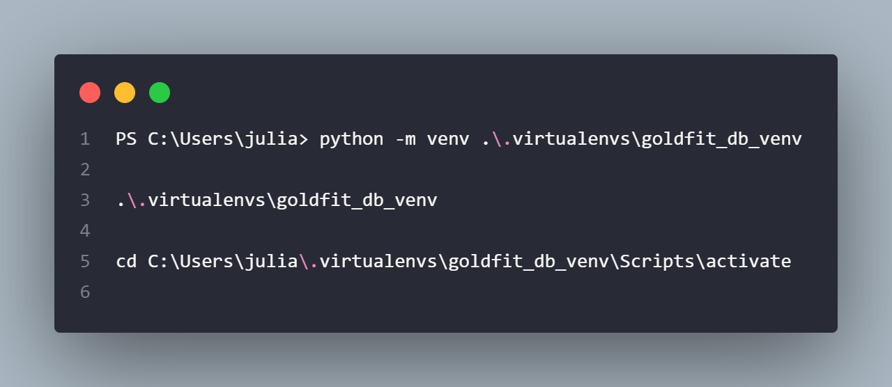

A virtualenv ativada fica da seguinte forma:

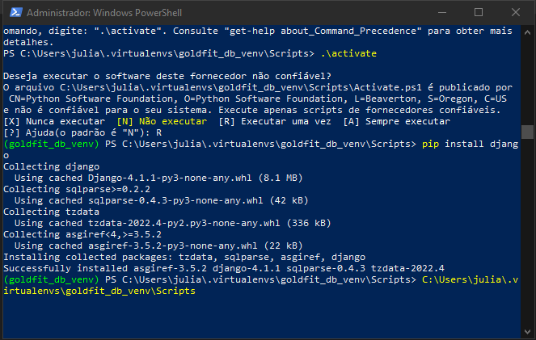

<hr/>

## Criação do Projeto

Configurar a Virtualenv no projeto e começar o projeto manager. Após a configuração da virtual env installar o django,
utilizando o comando a seguir:

```` bash
pip install django
````

Após a instalação do django, é necessário se direcionar ao diretório em que deseja criar a aplicação django.
Em seguida, executar o seguinte comando, passando o nome desejado como parâmetro, para que um app django seja criado com
suas pré-configurações.

```` bash
django-admin startapp goldfit_db
````

Após ser criada a aplicação apresenta a seguinte estrutura:

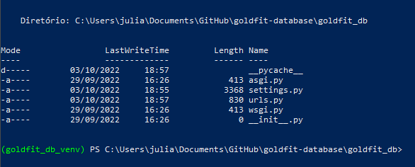

### Startapp vs Startproject

**Project:** Um Project em Django representa a aplicação web inteira, contendo todas as configurações, de modo que pode
conter diversos apps que implementam funcion diferentes dentro dele. Nele que está config, manage, entre outros. Os apps
devem ser registrados dentro do projeto.

**App:** Um App em Django é um módulo de um projeto, usado para implementar uma funcionalidade. O Project é a planta e o
App é cada um dos blocos que constrói o projeto.
<hr>

## Configuração do Projeto e da IDE

Como a IDE que está sendo utilizada é o PyCharm Community Edition, algumas configurações automáticas não estarão
diponíveis
como feature. Desse modo, essas configurações devem ser feitas de forma manual para que o projeto possa ser visualizado
e editado corretamente na IDE.

Para realizar a configuração, acessar a aba de Configurações (Settings) e buscar por interpreter. Desse modo,
informaremos
à IDE qual o interpretador de Python que desejamos utilizar no nosso projeto. Nesse caso, o interpretador utilizado será
a virtual env criada anteriormente.

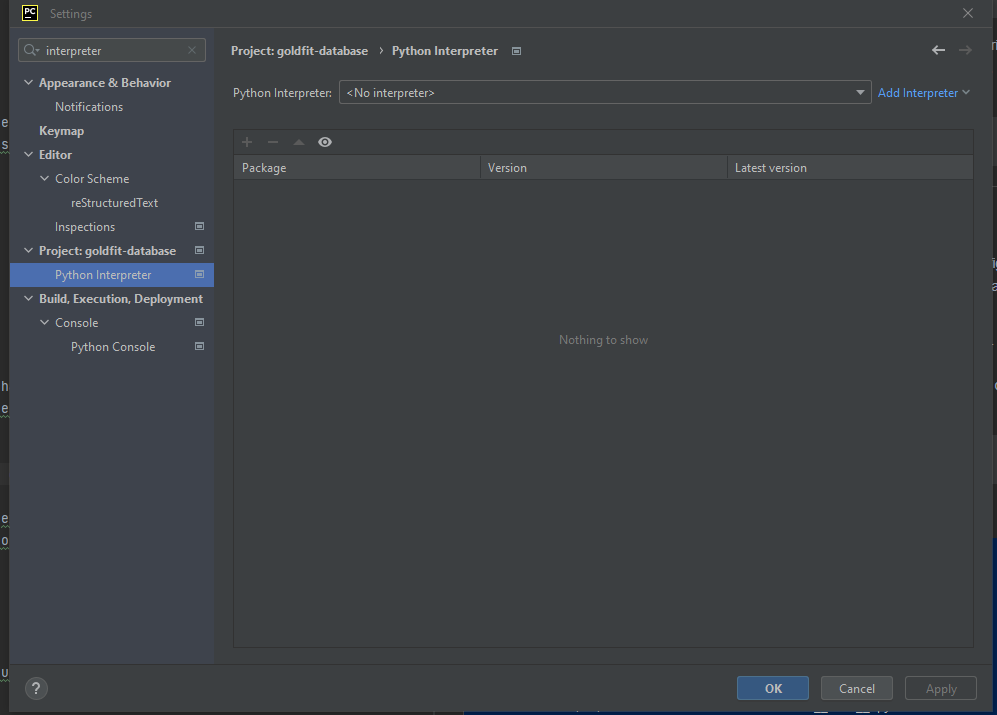

Para que a virtualenv apareça, pode ser necessário adicioná-la.

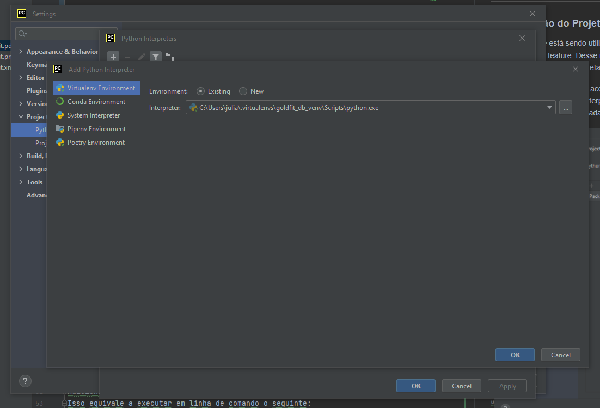

Após essas configurações, caso o arquivo manage.py seja executado apresentará erros. Desse modo, as configurações do
manage
devem ser acessadas. Não é necessário modificar seu interpreter, mas o parâmetro runserver desse ser adicionado.

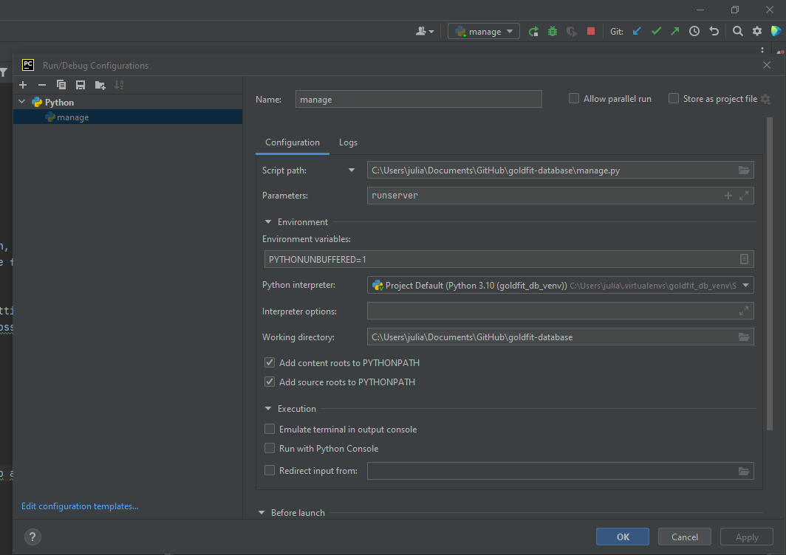

Resultado ao adicionar o parâmetro ````runserver```` ao executar o arquivo manage.py. A porta padrão do Django é a porta
8000.
Isso equivale a executar em linha de comando o seguinte:

```` bash
python manage.py runserver
````

<hr/>

## Criação de Rotas

Dentro da estrutura do projeto temos o arquivo `` urls.py``, é nesse arquivo que configuramos as rotas da nossa
aplicação.

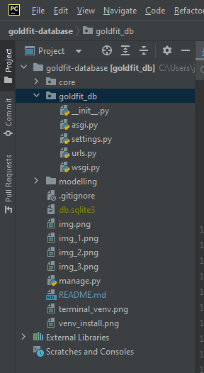

A rota ``admin`` é uma rota padrão do Django e não deve ser alterada. Abaixo temos um exemplo de uma rota que
retorna `` Hello
World``.

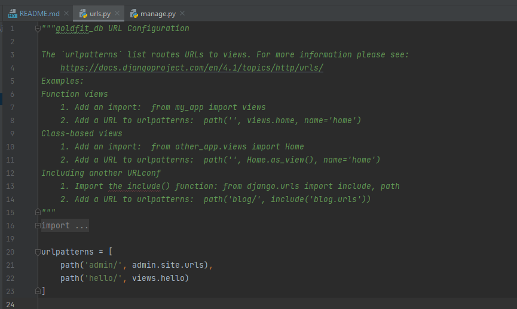

Após ser definida a rota, uma ``view`` e seu método que lida com a rota deve ser associada. As ``views`` se encontram na
pasta ``core`` dentro da estrutura do arquivo.

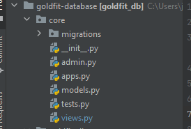
<hr/>

## Estrutura Básica do Django

- O ``django-admin`` é um utilitário responsável por realizar todas as tarefas administrativas do django.
- O ``manage`` é wrapper(embrulho) em volta do django-admin.py, delegando as tarefas para ele. Esse wrapper é necessário
  para colocar o pacote do projeto no sys.path e também para facilitar o uso de comando administrativos.
- O ``wsgi - Web Server Gateway Interface`` é a porta de entrada do servidor web. É uma plataforma padrão para
  aplicações
  web em Python. Com ele é possível plugar aplicações python com diversos servidores como apache, entre outros.
- O ``settings.py`` contém as configurações do projeot Django,coomo conexões com banco de dados, segurança, apps, entre
  outros.
- O ``urls.py`` é o schema de rodar das urls do projeto, no qual configuramos por onde cada rota será executada. É uma
  forma
  simples e eficiente de gerenciamento de URLs.
- As ``views.py`` são responsáveis pelo processamento das requisições dos clientes e por retornar uma resposta.
- Os ``models.py`` são responsáveis por definir os modelos de dados em Python. Os objetos do banco de dados são
  abstraídos,
  de modo que as tabelas e classes são transformados e a linguagem Python pode ser utilizada. O Django realiza a
  transformação
  de Python para SQL.
- O ``admin.py`` é a interface administrativa gerada pelo Django. Lê os metadados e é pronta para manipulação de dados.
- No ``static`` armazenamos arquivos estáticos como: CSS, Javascript, imagens, entre outros.
- O ``templates`` armazena todo conteúdo HTML da aplicação.

<hr/>

## Criando Tabelas e Usuários do Banco de Dados

Para criar um usuário rodar o seguinte comando:

```` bash
py manage.py createsuperuser
````

``
email: juliaeduardasousa@gmail.com |
senha: goldfitadminjulia2*
``

Após a criação do superusuario é possível acessar a página administrativa da aplicação Django. Dentro dessa página é
possível
modificar usuários, grupos, tipos de acessos, tabelas, entre outros.

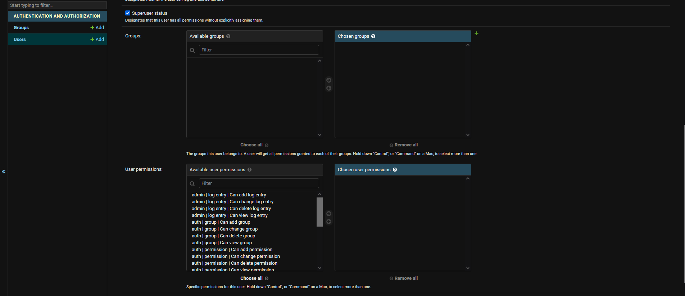

Para criarmos as tabelas no banco de dados, é necessário criar as classes no Python e, posteriormente, migrá-las.
Para criar os arquivos de migração é executado o seguinte comando, passando o nome do projeto como parâmetro:

```` bash
python manage.py makemigrations core
````

Resultado após criação dos arquivos de migration:

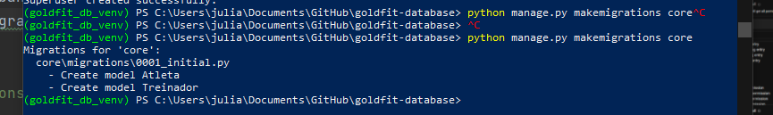

Após a criação do arquivo de migration fazemos a migration em si executando o seguinte comando:

```` bash
python manage.py sqlmigrate core 0001
````

Deve ser fornecido o nome da aplicação assim como o número do arquivo de migração. Após a realização das migrações
temos o seguinte resultado:

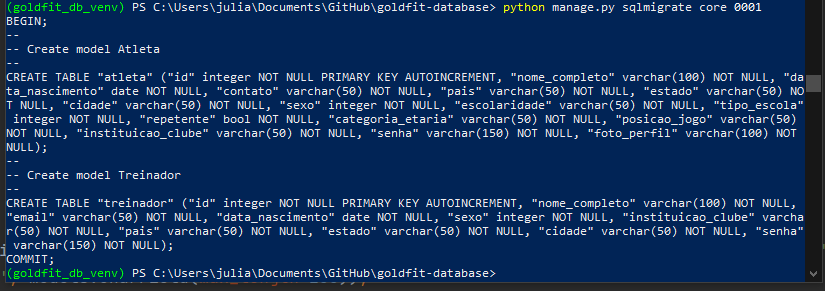

Após executar o comando acima, executar o seguinte comando passando também o nome da aplicação e da migration como
parâmetro

```` bash
python manage.py migrate core 0001
````

Após esse comando temos o seguinte:

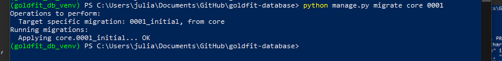

Após a criação de arquivos de migração e realização das migrações em si, devemos registrar as tabelas na
aplicação. Para isso, devemos adicionar e registrar o modelo de dados no arquivo ``admin.py``.

Além de registrarmos o modelo podemos também definir uma forma que os dados serão tratados e exibidos na página de
administrador.
Essa definição é feita no arquivo ``models.py``. Dentro de ``admin.py`` criamos uma classe de administração para essa
manipulação dos dados.

```` bash
python manage.py migrate core 0001
````

<hr/>

## Autenticação Utilizando JWT

A autenticação foi desenvolvida utilizando o pacote Simple JWT do Django Rest Framework para que a autenticação pelo 
React.JS possa ser feita
Documentação oficial do Simple JWT: <https://django-rest-framework-simplejwt.readthedocs.io/en/latest/>

Instalação:

```` bash
pip install djangorestframework-simplejwt
````

Adicionar às configurações do projeto:

```` python
REST_FRAMEWORK = {
    ...
    'DEFAULT_AUTHENTICATION_CLASSES': (
        ...
        'rest_framework_simplejwt.authentication.JWTAuthentication',
    )
    ...
}
````

Adicionar rota para autenticação:

```` python
from rest_framework_simplejwt.views import (
    TokenObtainPairView,
    TokenRefreshView,
)

urlpatterns = [
    ...
    path('api/token/', TokenObtainPairView.as_view(), name='token_obtain_pair'),
    path('api/token/refresh/', TokenRefreshView.as_view(), name='token_refresh'),
    ...
]
````

## Referencial Utilizado

- Vídeo Aula Django -
  DIO: <https://web.dio.me/course/desenvolvimento-para-internet-e-banco-de-dados-com-python-e-django/learning/8084a070-3bcd-47c8-93d1-683880f3cd00>
- Vídeo Aula Django REST Framework: <https://www.youtube.com/watch?v=i5JykvxUk_A&t=358s>
- Execution
  Policy: <https://learn.microsoft.com/en-us/powershell/module/microsoft.powershell.security/set-executionpolicy?view=powershell-7.3#:~:text=The%20Set-ExecutionPolicy%20uses%20the%20ExecutionPolicy%20parameter%20to%20specify,execution%20policy%20prevents%20you%20from%20running%20unsigned%20scripts>
- Execution Policy Stack
  Overflow: <https://pt.stackoverflow.com/questions/220078/o-que-significa-o-erro-execu%c3%a7%c3%a3o-de-scripts-foi-desabilitada-neste-sistema>
- Guia divertido sobre status HTTP: <https://httpcats.com/>
- Comentários em Python: <https://www.w3schools.com/python/python_comments.asp>
- Django x Django
  REST: <https://www.alura.com.br/artigos/django-django-rest-diferencas#:~:text=Segundo%20a%20documenta%C3%A7%C3%A3o%20oficial%2C%20o%20Django%20Rest%20gera,Framework%2C%20porque%20ele%20torna%20a%20serializa%C3%A7%C3%A3o%20mais%20f%C3%A1cil>
- Django with React: <https://www.geeksforgeeks.org/integrating-django-with-reactjs-using-django-rest-framework/>
- Unresolved referente to
  object: <https://stackoverflow.com/questions/60505898/unresolved-attribute-reference-objects-for-class>
- Foreign Keys no Django: <https://docs.djangoproject.com/en/4.1/topics/db/examples/many_to_one/>
- Queries SQL no Django: <https://www.youtube.com/watch?v=iWDvsMOngxk>
- Realizar Queries SQL no Django fazendo Bypass do ORM: <https://www.youtube.com/watch?v=_TtBxvYwoHY>
- Documentação Django sobre Queries SQL customizadas: <https://docs.djangoproject.com/en/4.1/topics/db/sql/>
- Gerar gráfico e documentação do projeto: <https://django-extensions.readthedocs.io/en/latest/graph_models.html>
- Fixtures para importar dados do JSON para o banco de dados: <https://docs.djangoproject.com/en/2.2/howto/initial-data/>
- Serialização para fixtures: <https://docs.djangoproject.com/en/2.2/topics/serialization/#serialization-formats>
- Uso de chaves naturais na serialização: <https://docs.djangoproject.com/en/dev/topics/serialization/#natural-keys>
- Alinhamento de imagem overleaf: <https://sites.google.com/site/macetescomlatex/posicionando-figuras>
- Apostila Web IFMG: <https://books.google.com.br/books?hl=pt-BR&lr=&id=lcLFAwAAQBAJ&oi=fnd&pg=PR1&dq=desenvolvimento+web&ots=kRRKxE17wv&sig=GnV2-d_uliTfbpax_qmmmeMbZ3w#v=onepage&q=desenvolvimento%20web&f=false>
- Livro Desenvolvimento Web: <https://books.google.com.br/books?hl=pt-BR&lr=&id=Jn6dTDF-wcsC&oi=fnd&pg=PT5&dq=desenvolvimento+web&ots=wNfMVPY7Yj&sig=n-equ84aAyrPJjzfndrR37tYqj0#v=onepage&q=desenvolvimento%20web&f=false>
- Livro Optimizing Websites: <https://books.google.com.br/books?hl=pt-BR&lr=&id=MHLJlUfXV4QC&oi=fnd&pg=PR23&dq=back+end+and+front+end+web&ots=82Guo6L5EF&sig=aJImI5ct7W6lPAa34cEzj49W0RA#v=onepage&q&f=false>
- Becode principais SGBDs: <https://becode.com.br/principais-sgbds/>
- Diferença de SQL para NoSQL: <https://www.oracle.com/br/database/nosql/what-is-nosql/>
- Imagem sistema banco de dados: <http://www.bosontreinamentos.com.br/bancos-de-dados/o-que-sao-bancos-de-dados/>
- Definição de ORM: <https://www.ufsm.br/pet/sistemas-de-informacao/2022/05/23/orm>
- Django Kenzie Academy: <https://kenzie.com.br/blog/django/>
- MDN Docs Django: <https://developer.mozilla.org/pt-BR/docs/Learn/Server-side/Django/Introduction>
- Como centralizar imagem no overleaf: <https://tex.stackexchange.com/questions/53862/how-do-i-align-an-image-to-center>
- O que é Python: <https://docs.python.org/3/faq/general.html#what-is-python>
- Ambiente virtual Python: <https://docs.python.org/pt-br/3/library/venv.html>
- Ambiente virtual Alura: <https://www.alura.com.br/artigos/ambientes-virtuais-em-python>
- IDE: <https://www.alura.com.br/artigos/o-que-e-uma-ide>
- Tabelas Overleaf: <https://pt.overleaf.com/learn/latex/Tables>
- Alinhamento de Texto Overleaf: <https://www.overleaf.com/learn/latex/Text_alignment>
- Dicionário de dados: <https://medium.com/psicodata/dicionario-de-dados-ac3ce726c34b>
- Tidy Data: <https://medium.com/psicodata/organizando-banco-de-dados-uma-introducao-ao-conceito-de-tidy-data-1296815aa100>
- Migrations Django: <https://docs.djangoproject.com/en/dev/topics/migrations/>
- Vídeo aula sobre autenticação Django + React: <https://www.youtube.com/watch?v=xjMP0hspNLE&t=1097s>
- Como utilizar Related Name: <https://stackoverflow.com/questions/2642613/what-is-related-name-used-for>
- Null Constraint Error: <https://stackoverflow.com/questions/42733221/django-db-utils-integrityerror-not-null-constraint-failed-products-product-ima>
- Componente Select MUI: <https://mui.com/material-ui/react-select/>
- Gauge/Speedometer: <https://martin36.github.io/react-gauge-chart/>
- Gauge/Speedometer: <https://github.com/palerdot/react-d3-speedometer>
- Documentação biblioteca de gráficos: <https://palerdot.in/react-d3-speedometer/?path=/story/reactspeedometer--default-with-no-config>
- Regex para números decimais: <https://rubular.com/r/N3jl1ifJDX>
- Radio Button/Radio Group: <https://mui.com/material-ui/react-radio-button/>
- Verificar se QuerySet está vazio: <https://iqcode.com/code/python/how-do-i-check-if-a-django-queryset-is-empty#:~:text=how%20do%20i%20check%20if%20a%20django%20queryset,many%3DTrue%29%20return%20Response%20%28serializer.data%29%20else%3A%20return%20Response%20%28status%3Dstatus.HTTP_404_NOT_FOUND%29>
- Diferentes tipos de usuários: <https://cursos.alura.com.br/forum/topico-autenticacao-basica-131051>
- Playlist de curso de Django ORM: <https://www.youtube.com/playlist?list=PLOLrQ9Pn6cayYycbeBdxHUFrzTqrNE7Pe>

## Atalhos Teclado -- PyCharm

- Ctrl + SHIFT + (+) = abre itens colapsados
- Ctrl + SHIFT + (-)  = colapsa métodos e classes
- Ctrl + L = localiza algo no documento
- Ctrl + ALT + L = formata um documento
- Ctrl + D = duplica uma linha
- SHIFT + ALT + direcional = muda uma linha de posição de acordo com a direção da seta
